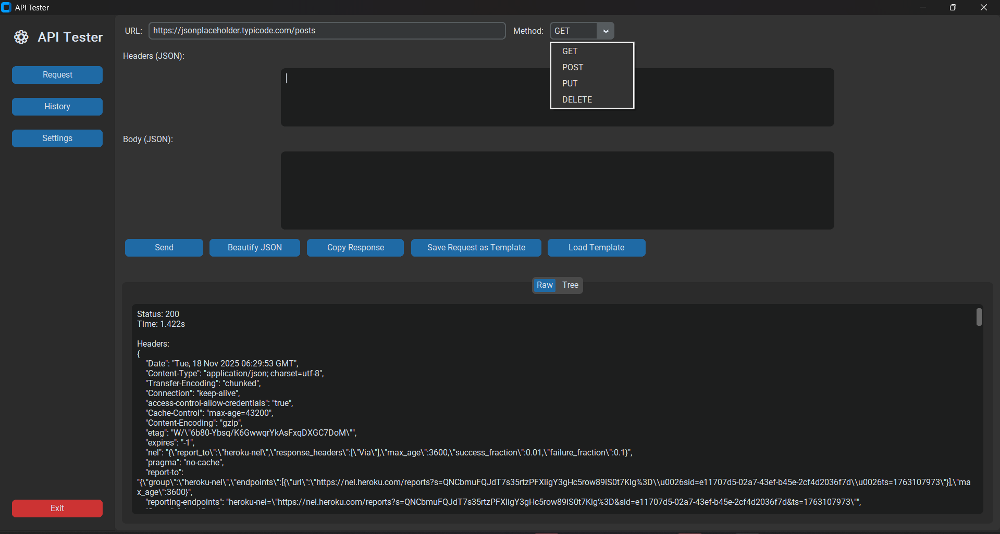
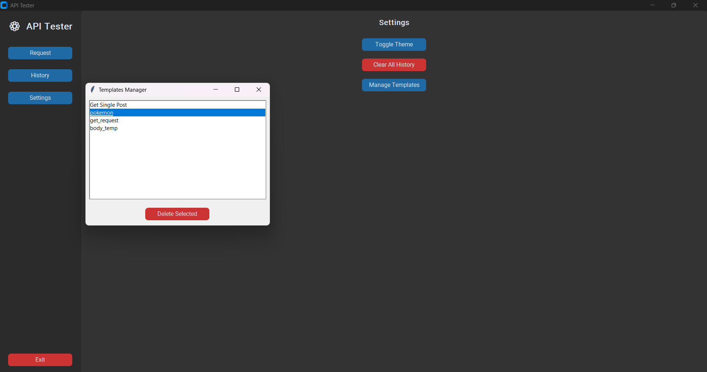

## ⭐ INTERNSHIP PROJECT – API Testing Tool (Python Desktop Application)
A modern API testing application built during my internship using Python & CustomTkinter.

---

## 📸 Screenshots

### 🔹 Home Screen

### 🔹 Settings Screen

---

## 🎥 Demo Video
GitHub does NOT allow playing MP4 inside README.  
Click below to watch:

---
## ✨ Features

- Send **GET, POST, PUT, DELETE** requests  
- Add custom headers and JSON body  
- Beautify JSON input/output  
- View responses in:
  - Raw JSON  
  - Formatted JSON  
  - Pretty Tree View  
- Maintain request history using SQLite  
- Save & load custom templates  
- Copy response to clipboard  
- Clean and modern UI using CustomTkinter  
- Handles long API responses without freezing the UI  

---

## 🛠️ Tech Stack

- Python 3  
- CustomTkinter (UI)  
- Requests (HTTP client)  
- SQLite (history / user database)  
- JSON / Tkinter TreeView  

---

## 📂 Project Structure

API-Testing--Tool/
│── assets/
│ └── icons/
│ └── screenshots/
│
│── core/
│ ├── api.py
│ ├── auth_db.py
│ ├── history.py
│ ├── templates.py
│
│── data/
│ ├── history.db
│ ├── templates.json
│ └── users.db
│
│── ui/
│ └── (UI components)
│
│── main.py
│── requirements.txt
│── README.md

---

## 🔧 Install dependencies

pip install -r requirements.txt

▶️ How to Run the Application
python main.py